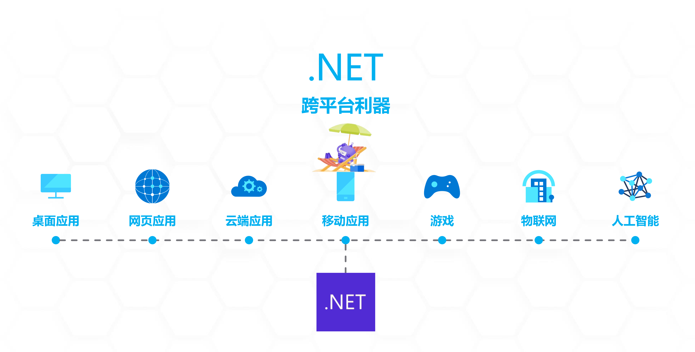
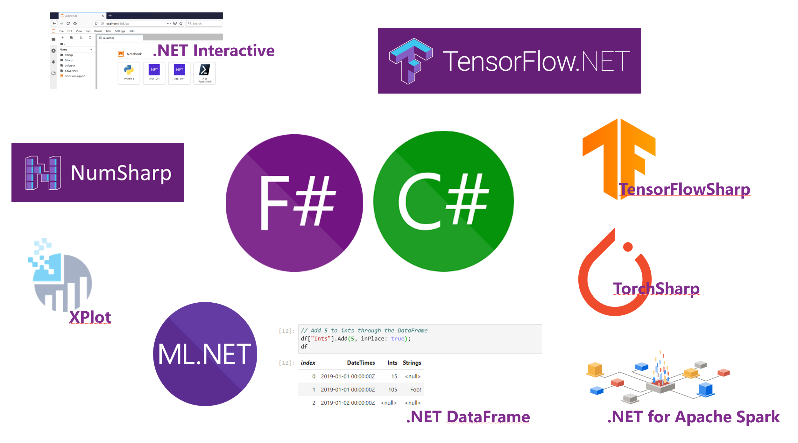

<h1 style="font-size:40px">.NET Core 人工智能系列-概述</h1>   
  
.NETer大家好，为大家送上.NET Core 下如何完成人工智能应用的系列，希望给.NETer进入人工智能领域提供一个指引。

.NET Core已经是一个全场景应用的技术栈方案，对于每一个领域都有支持。自从微软在开源发力后，.NET Core的社区能力也得到了补充。
  

  
人工智能是全球热点，在人工智能里面Python语言是第一世界，对于不少.NET程序员要进入到该领域有不少技术的壁垒。 当然有人会提到为何还要用.NET做机器学习？ 对于一个团队，是有技术延续性的，要投入一个新领域就要确保技术成本，如果要重新招聘一个Python团队，花费不少。用原有的技术能完成的事，是最好的解决方案，而且更能延续原有团队的创造力。对个人更好地把以往积累的经验应用在新领域也是非常好的事。

现阶段.NET Core 在人工智能里面能做什么？生态如何了？以下是一些原生的.NET Core 人工智能场景下的相关技术
  

  

## **.NET Interactive** ##

在传统的数据科学里面，数据科学家喜欢用Jupyter Notebook作为主要的环境工具。（Jupyter notebook 是一种 Web 应用，能让用户将说明文本、数学方程、代码和可视化内容全部组合到一个易于共享的文档中。）.NET Interactive 是一种Jupyter Notebook的扩展，让.NETer在Jupyter Notebook上通过C#/F#做数据相关的工作。

## **NumSharp** ##

在Python里面，我们需要用Numpy做大量数据处理，完成矩阵运算，多维数据的转换。NumSharp是第三方提供的开源的Numpy的.NET Core版本。(Github地址 <a href="https://github.com/SciSharp/NumSharp">https://github.com/SciSharp/NumSharp</a>)

## **.NET DataFrame** ##

在数据科学里面，数据分析是非常重要的一环，Pandas是Python场景下的重要工具。而对于.NET Core通过DataFrame
去完成相关数据分析工作，让你更快了解数据，调整数据。

## **XPlot** ##

通过XPlot你可以把数据生成不同的图表，找出数据特征。

## **.NET for Apache Spark** ##

.NET Core 原生支持大数据处理的Apache Spark

## **ML.NET** ##

ML.NET 是 Microsoft 的机器学习框架，它提供了一种在 .NET 生态系统中训练、创建和运行模型的简单方法。 这对 .NET 开发人员来说是个好消息，因为它可以让您重用作为 .NET 开发人员已经拥有的所有知识、技能、代码和库。 然而，这不仅仅是面向 .NET 开发人员的框架。 事实上，ML.NET 证明了自己是一个很棒的端到端工具，它使任何开发人员都能够创建复杂的管道并绑定到不同的数据源。

## **TensorFlow.NET** ##

TensorFlow.NET (TF.NET) 为 TensorFlow 提供了 .NET Standard 绑定。 它旨在用 C# 实现完整的 Tensorflow API，允许 .NET 开发人员使用跨平台的 .NET Standard 框架开发、训练和部署机器学习模型。 TensorFlow.NET 内置了 Keras 高级接口，并作为独立包 TensorFlow.Keras 发布。(Github地址 <a href="https://github.com/SciSharp/TensorFlow.NET">https://github.com/SciSharp/TensorFlow.NET</a>)

## **TensorFlowSharp** ##

TensorFlowSharp 是一个TensorFlow模型运行时，和TensorFlow.NET 相比缺少很多如图计算，训练等功能。(Github地址 <a href="https://github.com/migueldeicaza/TensorFlowSharp">https://github.com/migueldeicaza/TensorFlowSharp</a>)

# **TorchSharp** #

TorchSharp 是一个 .NET 库，可提供对支持 PyTorch 的库的访问。(Github地址 <a href="https://github.com/xamarin/TorchSharp">https://github.com/xamarin/TorchSharp</a>)

通过上述原生库，你可以通过C#/F#完成相关的技术，本次系列会从最基础的知识说起，包括环境搭建，基本概念，机器学习相关算法，以及深度学习，希望能让.NETer更好学习人工智能的知识。

