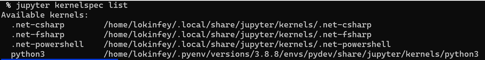
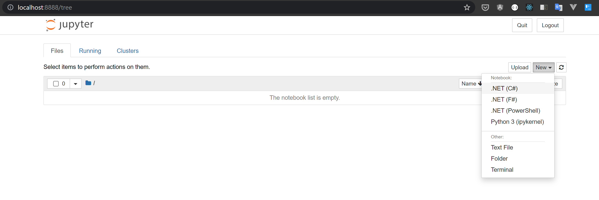
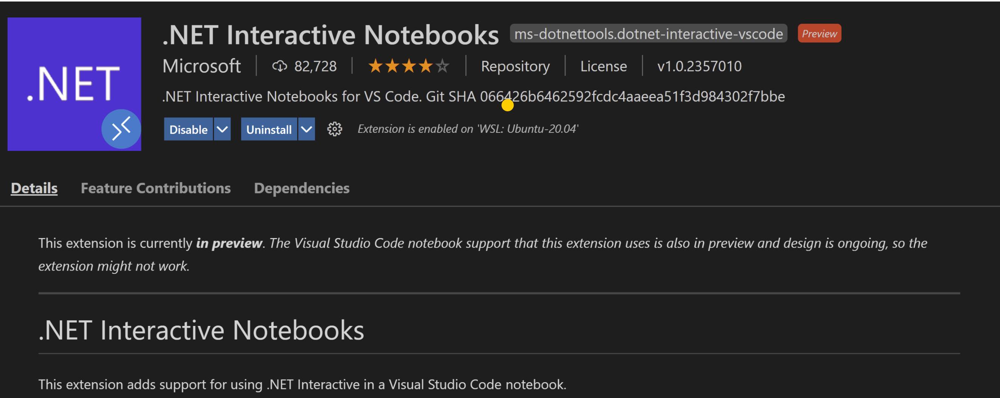
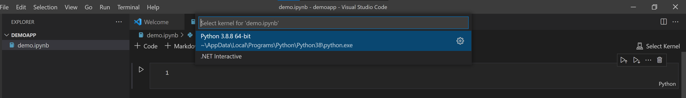
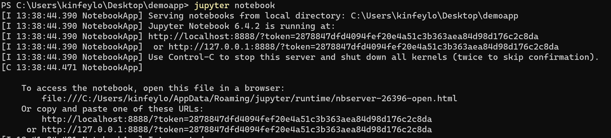
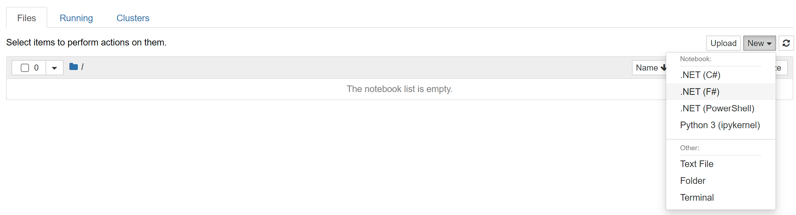
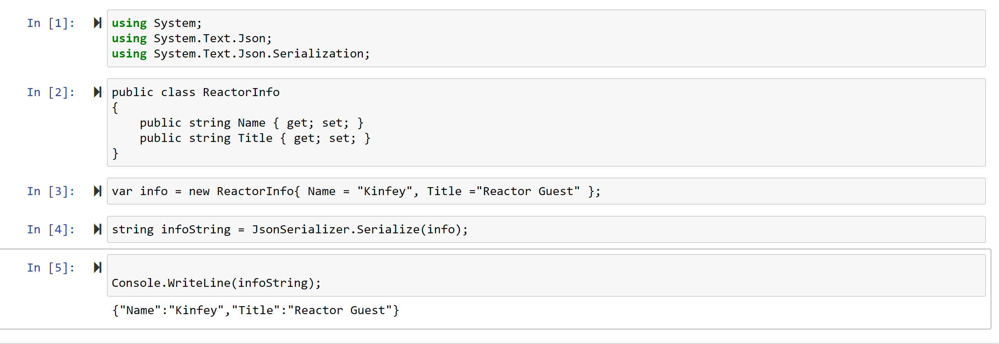
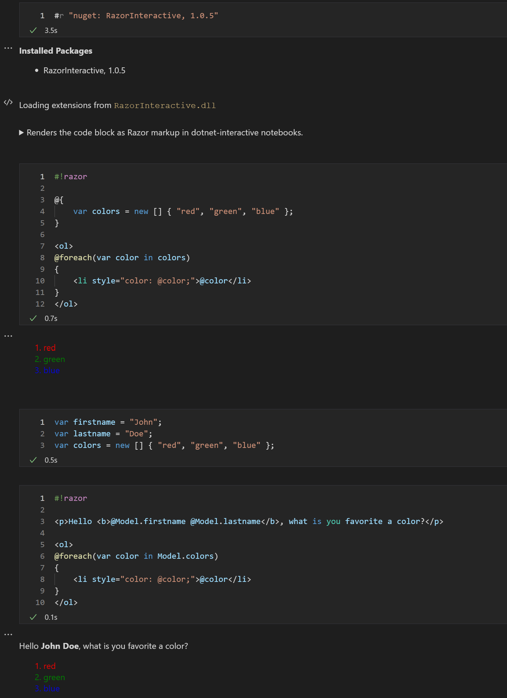

<h1 style="font-size:40px">.NET Core 人工智能系列-.NET Interactive环境介绍</h1>

在进入.NET Core 的人工智能应用开始前，我们先把环境搭建好，为以后的学习提供一个便利。

作为一个.NET 程序员，或者其他编程语言的程序员，相信对IDE的依赖必不可少，如Visual Studio/Visual StudioCode , IntelliJ , Eclipse等。但是对于一个从事数据科学的人来说，和传统的编程相比又有所不同，他们更喜欢通过Notebook作为主要的数据科学工作的工具。通过概述的学习，你可能知道这一个重要的知识点，但具体还是要和大家介绍以下。环境配置，我们也从.NET Interactive开始。

<h2><b>为何要用Jupyter Notebook？</b></h2>


我们先看看Jupyter Notebook 是什么，。Jupyter 是一种免费的、开源的、交互式网络工具，称为计算笔记本，研究人员可以使用它在单个文档中组合软件代码、计算输出、解释性文本和多媒体资源。 Jupyter Notebook有以下特性

<b>数据分析：</b>Jupyter Notebook允许用户在线查看代码的结果，而无需依赖代码的其他部分。 在笔记本中，可以随时检查代码的每个单元格以绘制输出。 因此，与 传统IDE 不同，Jupyter Notebook有助于在线打印输出，这对于探索性数据分析 (EDA) 过程非常有用。

<b>每个cell都有缓存：</b>传统开发工具要保留每行的执行状态都比较难，但 Jupyter Notebook可以缓存每行的结果——无论是训练 ML 模型的本地代码还是从远程服务下载的代码。

<b>和编程语言无关：</b>支持多种语言，多种格式。

<b>数据可视化：</b>作为一个组件， Jupyter Notebook支持可视化并包括渲染一些数据集，如图形和图表，这些数据集是在 Matplotlib、Plotly 或 Bokeh 等模块的帮助下从代码生成的。 Jupyter 允许用户叙述可视化，同时共享代码和数据集，使其他人能够进行交互式更改。

<b>与代码的实时交互：</b>Jupyter Notebook 使用“ipywidgets”包，它提供了用于探索代码和数据交互性的标准用户界面。因此代码可以由用户编辑，也可以发送重新运行，使 Jupyter 的代码非静态。它允许用户控制代码的输入源并直接在浏览器上提供反馈。

<b>记录代码示例：</b>Jupyter 使用户可以轻松地逐行解释他们的代码，并附带反馈。更好的是，使用 Jupyter，用户可以添加交互性和解释，同时代码功能齐全。

<h2><b>.NET Interactive 介绍</b></h2>

.NET Interactive  就是一个更灵活的代码交互方式，专注于数据浏览与整理。 你可以把他看作Jupyter Notebook下的.NET 插件。如果你曾经接触过Xamarin你会发现它和Xamarin Workbooks很像，通过.NET Interactive 可以写简单的代码，而且还可以通过Nuget引入相关的package ，让你在数据分析，代码探索，机器学习场景更好地应用你熟悉.NET Core 技术。

.NET Interactive 是.NET 团队开发的插件，可以支持传统的Jupyter Notebook 的页面使用，也可以通过Visual Studio Code 安装.NET Interactive 的插件直接在IDE 开发。

<h2><b>.NET Interactive 安装</b></h2>

.NET Interactive的安装需要以来于Python 以及安装JupyterNotebook，所以你需要在你的机器上安装Python(建议安装3.8.x 的Python版本)，如果你安装Python 成功后需要通过命令行安装
```zsh
pip3 install jupyter
```

安装成功后，别忘记在本机安装.NET Core，.NET Interactive 支持.NET Core 3.x+的版本(建议本机安装.NET Core 5.x 的版本),安装成功后 ，就可以通过dotnet tool 安装.NET Interactive 了

```zsh
dotnet tool install --global Microsoft.dotnet-interactive
```

<b>注意：</b> dotnet tool 需要配置全局PATH ，否则会影响dotnet-interactive的运行 (关于 dotnet tool path 的文档可以参考 <a href="https://docs.microsoft.com/en-us/dotnet/core/tools/dotnet-tool-install">https://docs.microsoft.com/en-us/dotnet/core/tools/dotnet-tool-install</a>)

把.NET Interactive 绑定到Jupyter Notebook
```zsh
dotnet-interactive jupyter install
```

通过运行以下命令检查.NET Interactive是否已经已经增加到Jupyter Notebook 的支持环境下：  
  
```zsh
jupyter kernelspec list
```




完成以上相关操作后，你就可以直接通过Jupyter Notebook 调用.NET Interactive去使用C#/F#完成数据科学的工作了 。  
  
你可以通过命令行的方式去运行  
  
```zsh
jupyter notebook
```

注意:

如果你是第一次运行jupyter notebook 有可能提示你输入密码，你可以通过以下链接完成密码修改工作

<a href="https://jupyter-notebook.readthedocs.io/en/stable/public_server.html">https://jupyter-notebook.readthedocs.io/en/stable/public_server.html</a>
<br/><br/>



如果你希望获取更多Jupyter Notebook 的知识可以访问以下链接

<a href="https://jupyter-notebook.readthedocs.io/en/stable/">https://jupyter-notebook.readthedocs.io/en/stable/</a>

也可以通过Visual Studio Code 安装.NET Interactive后直接运行Notebook的应用。


<br/><br/>
<br/><br/>

<h2><b>使用.NET Interactive示例一</b></h2>

在本机命令行任意位置创建一个文件夹，然后进入该文件夹，直接输入jupyter notebook 
```zsh
mkdir demoapp
cd demoapp
jupyter notebook
```


<br/><br/>

在浏览器打开输入http://localhost:8888

<br/><br/>

通过点击New 选择C# 创建一个新的notebook 文件

然后每行依次输入

```csharp
using System;
using System.Text.Json;
using System.Text.Json.Serialization;
```

```csharp
public class ReactorInfo
{
    public string Name { get; set; }
    public string Title { get; set; }
}
```

```csharp
var info = new ReactorInfo{ Name = "Kinfey", Title ="Reactor Guest" };
```

```csharp
string infoString = JsonSerializer.Serialize(info);
```

```csharp
Console.WriteLine(infoString);
```

这里注意通过菜单栏的’+‘增加行

然后按Run运行逐行代码可以看到以下结果


<br/><br/>

<h2><b>使用.NET Interactive示例二</b></h2>

在Visual Studio Code 创建一个以.ipynb的文件(.ipynb是Notebook的默认文件)，然后通过nuget 添加RazorInteractive库（RazorInteractive 是一个可以让你在.NET Interactive下写做可交互的Razor模板操作）

```csharp
#r "nuget: RazorInteractive, 1.0.5"
```

在导入成功下，分别每行添加以下代码

```csharp
#!razor

@{
    var colors = new [] { "red", "green", "blue" };
}

<ol>
@foreach(var color in colors)
{
    <li style="color: @color;">@color</li>
}
</ol>
```

```csharp
var firstname = "John";
var lastname = "Doe";
var colors = new [] { "red", "green", "blue" };
```

```csharp
#!razor

<p>Hello <b>@Model.firstname @Model.lastname</b>, what is you favorite a color?</p>

<ol>
@foreach(var color in Model.colors)
{
    <li style="color: @color;">@color</li>
}
</ol>
```
每行执行，你可以看到以下结果

<br/><br/>

.NET Interactive让你的.NET编程变得有趣，为你在一些实验环境，一些教学上提供了更方便的支持，而且结合以后的学习你可以非常简易地完成数据交互的操作，让.NET 程序员完成数据科学的工作更容易。大家快快尝试下吧。