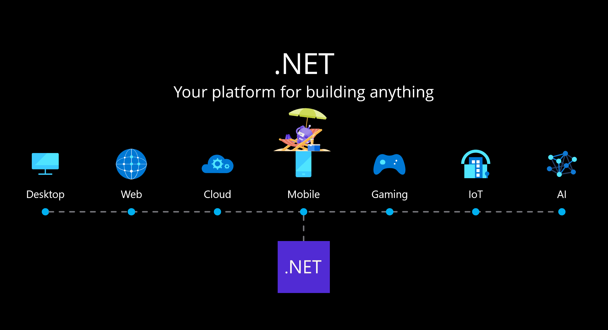
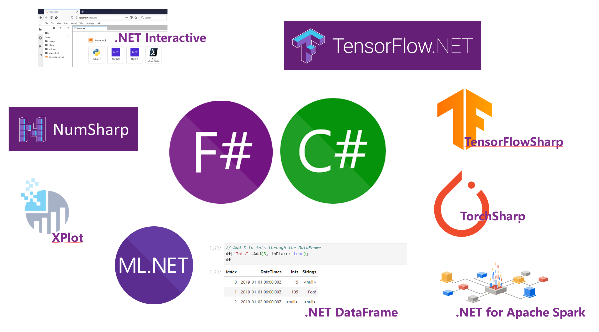

<h1 style="font-size:40px">.NET Core 
In Artificial Intelligence Series-Overview</h1>   
  
Hi .NET Developer, this is a series of how to complete artificial intelligence applications under .NET Core, and hope to provide a guide for .NET Developer to enter the field of artificial intelligence.

.NET Core is already a technology stack solution for full-scene applications, with support for every field. Since Microsoft's efforts in open source, the community capabilities of .NET Core have also been supplemented.
  

  
Artificial intelligence is a global hotspot. In artificial intelligence, the Python language is the first world. There are many technical barriers for many .NET programmers to enter this field. Of course, some people will mention why we need to use .NET for machine learning? For a team, there is technical continuity. If you want to invest in a new field, you must ensure the technical cost. If you want to recruit a Python team, it will cost a lot. What can be done with the original technology is the best solution, and it can continue the creativity of the original team. It is also very good for individuals to better apply the experience accumulated in the past in new fields.

What can .NET Core do in artificial intelligence at this stage? How is the ecology? The following are some related technologies in native .NET Core artificial intelligence scenarios
  

  

## **.NET Interactive** ##

In traditional data science, data scientists like to use Jupyter Notebook as the main environmental tool. (Jupyter notebook is a web application that allows users to combine explanatory text, mathematical equations, code, and visual content into one easy-to-share document.) .NET Interactive is an extension of Jupyter Notebook that allows .NET Developers to work in Jupyter Use C#/F# to do data-related work on Notebook.

## **NumSharp** ##

In Python, we need to use Numpy to do a large amount of data processing, complete matrix operations, and multi-dimensional data conversion. NumSharp is an open source .NET Core version of Numpy provided by a third party. (Github  <a href="https://github.com/SciSharp/NumSharp">https://github.com/SciSharp/NumSharp</a>)

## **.NET DataFrame** ##

In data science, data analysis is a very important part, and Pandas is an important tool in the Python scenario. For .NET Core, data analysis is done through DataFrame, allowing you to understand and adjust data faster.

## **XPlot** ##

Through XPlot, you can generate different charts from the data and find out the characteristics of the data.

## **.NET for Apache Spark** ##

.NET Core natively supports Apache Spark for big data processing

## **ML.NET** ##

ML.NET is Microsoft's machine learning framework, which provides an easy way to train, create, and run models in the .NET ecosystem. This is great news for .NET developers, because it allows you to reuse all the knowledge, skills, code, and libraries you already have as a .NET developer. However, this is not just a framework for .NET developers. In fact, ML.NET has proven itself to be a great end-to-end tool that enables any developer to create complex pipelines and bind to different data sources.

## **TensorFlow.NET** ##

TensorFlow.NET (TF.NET) provides .NET Standard bindings for TensorFlow. It aims to implement a complete Tensorflow API in C#, allowing .NET developers to use the cross-platform .NET Standard framework to develop, train, and deploy machine learning models. TensorFlow.NET has built-in Keras high-level interface and is released as an independent package TensorFlow.Keras. (Github  <a href="https://github.com/SciSharp/TensorFlow.NET">https://github.com/SciSharp/TensorFlow.NET</a>)

## **TensorFlowSharp** ##

TensorFlowSharp is a TensorFlow model runtime. Compared with TensorFlow.NET, it lacks many functions such as graph calculation and training. (Github  <a href="https://github.com/migueldeicaza/TensorFlowSharp">https://github.com/migueldeicaza/TensorFlowSharp</a>)

# **TorchSharp** #

TorchSharp is a .NET library that provides access to libraries that support PyTorch. (Github  <a href="https://github.com/xamarin/TorchSharp">https://github.com/xamarin/TorchSharp</a>)

通过上述原生库，你可以通过C#/F#完成相关的技术，本次系列会从最基础的知识说起，包括环境搭建，基本概念，机器学习相关算法，以及深度学习，希望能让.NETer更好学习人工智能的知识。

