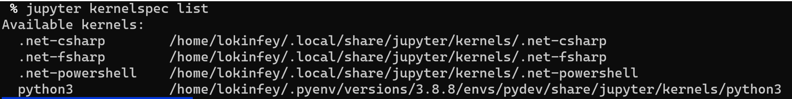
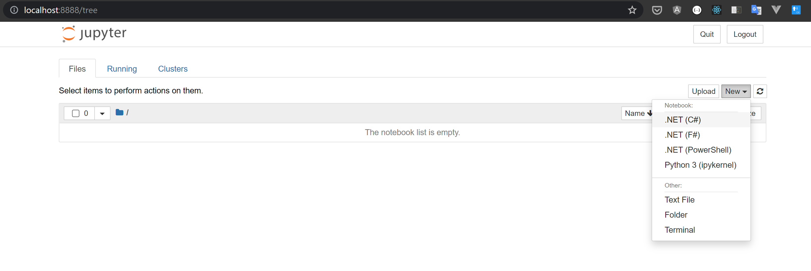
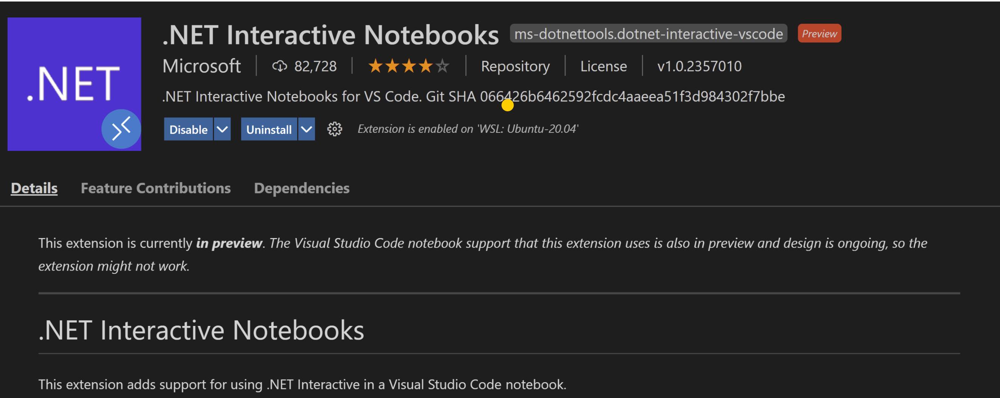
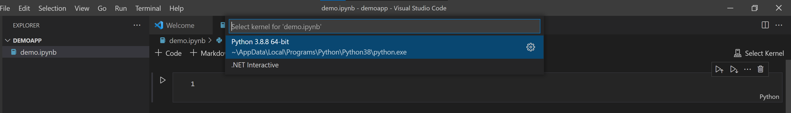
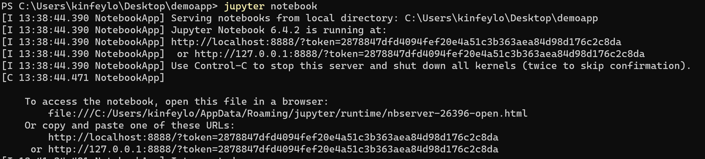
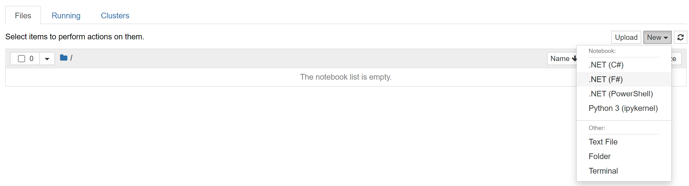
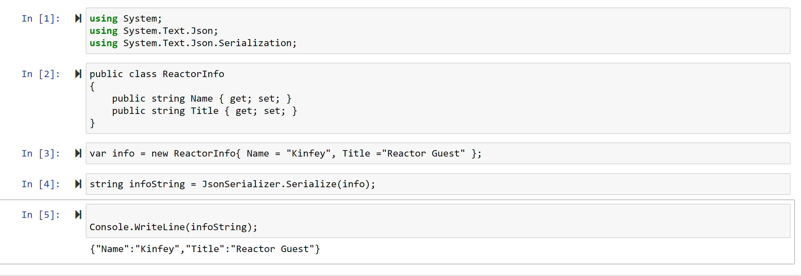
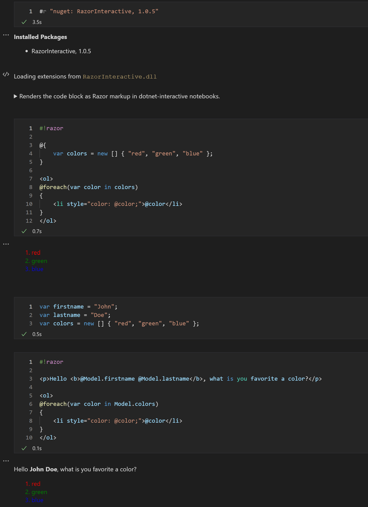

<h1 style="font-size:40px">.NET Core in Artificial Intelligence Series-Introduction to .NET Interactive </h1>

Before entering the artificial intelligence application of .NET Core, we first set up the environment to provide a convenience for future learning.

As a .NET programmer, or programmer of other programming languages, I believe that the dependence on IDE is essential, such as Visual Studio/Visual StudioCode, IntelliJ, Eclipse, etc. But for a person engaged in data science, compared with traditional programming, they prefer to use Notebook as the main tool for data science work. Through the overview of the study, you may know this important point of knowledge, but the specifics still have to be introduced to you as follows. Environment configuration, we also start from .NET Interactive.

<h2><b>Why use Jupyter Notebook?</b></h2>


Let’s take a look at what Jupyter Notebook is. Jupyter is a free, open source, interactive network tool called a computing notebook. Researchers can use it to combine software code, computing output, explanatory text, and multimedia resources in a single document. Jupyter Notebook has the following features:

<b>Data analysis:</b> Jupyter Notebook allows users to view the results of the code online without relying on other parts of the code. In the notebook, you can check each cell of the code at any time to draw the output. Therefore, unlike traditional IDEs, Jupyter Notebook facilitates online printouts, which is very useful for exploratory data analysis (EDA) processes.

<b>Each cell has a cache:</b> It is difficult for traditional development tools to retain the execution status of each line, but Jupyter Notebook can cache the results of each line-whether it is the local code for training the ML model or remotely The code downloaded by the service.

<b>It has nothing to do with programming language:</b> It supports multiple languages ​​and multiple formats.

<b>Data visualization:</b> As a component, Jupyter Notebook supports visualization and includes rendering some data sets, such as graphs and charts, which are generated from code with the help of modules such as Matplotlib, Plotly or Bokeh. Jupyter allows users to visualize narratives while sharing code and data sets, enabling others to make interactive changes.

<b>Real-time interaction with code:</b> Jupyter Notebook uses the "ipywidgets" package, which provides a standard user interface for exploring the interactivity of code and data. Therefore, the code can be edited by the user or sent to re-run, making the Jupyter code non-static. It allows the user to control the input source of the code and provide feedback directly on the browser.

<b>Record code examples:</b> Jupyter allows users to easily explain their code line by line with feedback. Even better, with Jupyter, users can add interactivity and explanation, while the code is fully functional.

<h2><b>Introduce .NET Interactive </b></h2>

.NET Interactive is a more flexible way of code interaction, focusing on data browsing and sorting. You can think of it as a .NET plugin under Jupyter Notebook. If you have ever been try Xamarin, you will find that it is very similar to Xamarin Workbooks. You can write simple code through .NET Interactive, and you can also introduce related packages through Nuget, allowing you to perform better in data analysis, code exploration, and machine learning scenarios. You are familiar with .NET Core technology.

.NET Interactive is a plug-in developed by the .NET team, which can support the use of traditional Jupyter Notebook pages, or you can install the plug-in of .NET Interactive through Visual Studio Code to develop directly in the IDE.

<h2><b>Install .NET Interactive </b></h2>

The installation of .NET Interactive requires Python and the installation of JupyterNotebook, so you need to install Python on your machine (it is recommended to install the 3.8.x Python version), if you install Python successfully, you need to install it through the command line
```zsh
pip3 install jupyter
```

After the installation is successful, don’t forget to install .NET Core on this machine. .NET Interactive supports the .NET Core 3.x+ version (it is recommended to install the .NET Core 5.x version on this machine). After the installation is successful, you can use the dotnet tool .NET Interactive is installed

```zsh
dotnet tool install --global Microsoft.dotnet-interactive
```

<b>Note:</b> dotnet tool needs to configure the global PATH, otherwise it will affect the operation of dotnet-interactive (for the dotnet tool path documentation, please refer to <a href="https://docs.microsoft.com/en- us/dotnet/core/tools/dotnet-tool-install">https://docs.microsoft.com/en-us/dotnet/core/tools/dotnet-tool-install</a>)

Bind .NET Interactive to Jupyter Notebook

```zsh
dotnet-interactive jupyter install
```

Check whether .NET Interactive has been added to the support environment of Jupyter Notebook by running the following command:  
  
```zsh
jupyter kernelspec list
```




After completing the above related operations, you can directly call .NET Interactive through Jupyter Notebook to use C#/F# to complete data science work.
  
You can run it through the command line
  
```zsh
jupyter notebook
```

Notice:

If you are running jupyter notebook for the first time, you may be prompted to enter a password, you can complete the password modification work through the following link

<a href="https://jupyter-notebook.readthedocs.io/en/stable/public_server.html">https://jupyter-notebook.readthedocs.io/en/stable/public_server.html</a>
<br/><br/>



If you want to get more knowledge of Jupyter Notebook, you can visit the following link

<a href="https://jupyter-notebook.readthedocs.io/en/stable/">https://jupyter-notebook.readthedocs.io/en/stable/</a>

You can also run the Notebook application directly after installing .NET Interactive through Visual Studio Code.


<br/><br/>
<br/><br/>

<h2><b>Example A</b></h2>

Create a folder anywhere on the command line of the machine, then enter the folder and input jupyter notebook directly 
```zsh
mkdir demoapp
cd demoapp
jupyter notebook
```


<br/><br/>

Open the browser and enter http://localhost:8888

<br/><br/>

Create a new notebook file by clicking New and selecting C#

input these codes cell by cell

```csharp
using System;
using System.Text.Json;
using System.Text.Json.Serialization;
```

```csharp
public class ReactorInfo
{
    public string Name { get; set; }
    public string Title { get; set; }
}
```

```csharp
var info = new ReactorInfo{ Name = "Kinfey", Title ="Reactor Guest" };
```

```csharp
string infoString = JsonSerializer.Serialize(info);
```

```csharp
Console.WriteLine(infoString);
```

Note here that through the "+" in the menu bar to increase the line

Then press Run to run the code line by line, you can see the following results


<br/><br/>

<h2><b>Sample 2</b></h2>

Create a .ipynb file in Visual Studio Code (.ipynb is the default file of Notebook), and then add the RazorInteractive library through nuget (RazorInteractive is a Razor template that allows you to write interactively under .NET Interactive)

```csharp
#r "nuget: RazorInteractive, 1.0.5"
```

After the import is successful, add the following code in each line

```csharp
#!razor

@{
    var colors = new [] { "red", "green", "blue" };
}

<ol>
@foreach(var color in colors)
{
    <li style="color: @color;">@color</li>
}
</ol>
```

```csharp
var firstname = "John";
var lastname = "Doe";
var colors = new [] { "red", "green", "blue" };
```

```csharp
#!razor

<p>Hello <b>@Model.firstname @Model.lastname</b>, what is you favorite a color?</p>

<ol>
@foreach(var color in Model.colors)
{
    <li style="color: @color;">@color</li>
}
</ol>
```
Each line is executed, you can see the following results

<br/><br/>

NET Interactive makes your .NET programming interesting, provides you with more convenient support in some experimental environments and some teaching, and combined with future learning, you can easily complete data interaction operations and make .NET programs It’s easier for employees to complete data science tasks. Everyone quickly try it.